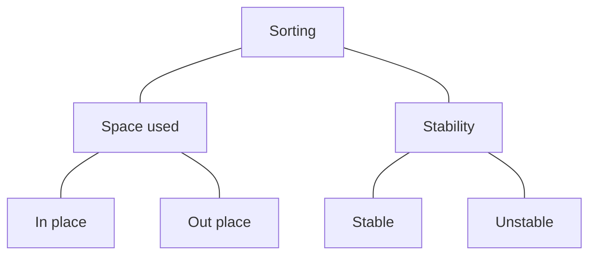

### What is Sorting?
By definition sorting refers to arranging data in a particular format: either ascending or descending.

### Types of Sorting:

### Classification By Space (Memory) usage:
- **In place sorting:** Sorting algorithms which does not require any extra space for sorting
    - **Example:** Bubble Sort
- **Out place sorting:** Sorting algorithms which requires an extra space for sorting
    - **Example:** Merge Sort

### Classification By Stability:
- **Stable sorting:** If a sorting algorithm after sorting the contents does not change the sequence of similar content in which they appear, then this sorting is called stable sorting.
    - **Example:** Insertion Sort, Merge Sort
- **Unstable sorting:** If a sorting algorithm after sorting the content change the sequence of similar content in which they appear, then it is called unstable sorting.
    - **Example:** Selection Sort, Quick Sort

### Sorting Terminology:
- **Increasing Order**
    - If successive element is greater than the previous one
    - Example: 1, 3, 5, 7, 9, 11
- **Decreasing Order**
    - If successive element is less than the previous one
    - Example: 11, 9, 7, 5, 3, 1
- **Non Increasing Order**
    - If successive element is less than or equal to its previous element in the sequence
    - Example: 11, 9, 7, 5, 5, 3, 1
- **Non Decreasing Order**
    - If successive element is greater than or equal to its previous element in the sequence
    - Example: 1, 3, 5, 5, 7, 9, 11

### Some Important Sorting Algorithms:
- Bubble Sort
- Selection Sort
- Insertion Sort
- Bucket Sort
- Merge Sort
- Quick Sort
- Heap Sort

**Criteria for selecting a sorting algorithm:**
- Stability
- Space efficient
- Time efficient
---

### Bubble Sort
- Bubble sort is also referred as Sinking sort
- Bubble sort is the simplest sorting algorithm.
- It works by iterating the input array from the first element to the last, comparing each pair of elements and swapping them if needed.
- Generally, insertion sort has better performance than bubble sort.
- The only significant advantage that bubble sort has over other implementations is that it can detect whether the input list is already sorted or not.

**When to use Bubble Sort?**
- When the input is almost sorted
- Space is a concern
- Easy to implement

**When to avoid Bubble Sort?**
- Time complexity is poor, so if we need efficient sorting algorithm we need to avoid it.

**Performance of Bubble Sort:**
- Worst case complexity: `O(n2)`
- Best case complexity (Improved version): `O(n)`
- Worst case space complexity: `O(1)`
---

### Selection Sort
- In case of selection sort we repeatedly find the minimum element and move it to the sorted part of array to make unsorted part sorted

**When to use Selection Sort?**
- When we have insufficient memory
- Easy to implement

**When to avoid Selection Sort?**
- When time is a concern

**Performance of Selection Sort:**
- Worst case complexity: `O(n2)`
- Best case complexity: `O(n2)`
- Worst case space complexity: `O(1)`
---

### Insertion Sort
- Devide the given array into two part
- Take first element from unsorted array and find its correct position in sorted array
- Repeat until unsorted array is empty

**When to use Insertion Sort?**
- When we have insufficient memory
- Easy to implement
- When we have continuous inflow of numbers and we want to keep them sorted
- Practically more efficient than selection and bubble sorts, even though all of them have O(n2) worst case complexity

**When to avoid Insertion Sort?**
- When time is a concern

**Performance of Insertion Sort:**
- Worst case complexity: `O(n2)`
- Best case complexity: `O(n)`
- Worst case space complexity: `O(1)`

**Comparisons to Bubble and Selection Sort**
- Bubble sort takes $\frac{n^2}{2}$ comparisons and $\frac{n^2}{2}$ swaps (inversions) in both average case and in worst case.
- Selection sort takes $\frac{n^2}{2}$ comparisons and n swaps.
- Insertion sort takes $\frac{n^2}{4}$ comparisons and $\frac{n^2}{8}$ swaps in average case and in the worst case they are double.
- Insertion sort is almost linear for partially sorted input.
- Selection sort is best suits for elements with bigger values and small keys.
---

### Bucket Sort
- Create buckets and distribute elements of array into buckets
- Sort buckets individually
- Merge buckets after sorting

**Equations**
- Number of buckets = round(sqrt(number of elements))
- Appropriate bucket = celi(value * number of buckets / maxValue)
- Sort all buckets (using any sorting algorithm)

**When to use Bucket Sort?**
- When input uniformly distributed over range
    - **Example:** 
        - uniformly distributed = (1,2,4,5,3,8,7,9)
        - not uniformly distributed = (1,2,4,91,93,95)

**When to avoid Bucket Sort?**
- When space is a concern

**Performance of Bucket Sort:**
- Worst case complexity: `O(N logN)`
- Worst case space complexity: `O(n)`
---

### Merge Sort
- Merge sort is a divide and conquer algorithm
- Divide the input array in two halves and we keep halving recursively until they become too small that can not be broken further
- Merge halves by sorting them

**When to use Merge Sort?**
- When you need stable sort
- When average expected time is O(NlogN)

**When to avoid Merge Sort?**
- When space is a concern

**Performance of Merge Sort:**
- Worst case complexity: `O(N logN)`
- Worst case space complexity: `O(n)`
---

### Quick Sort
- Quick is a divide and conquer algorithm
- Find pivot number and make sure smaller number located at the left of pivot and bigger numbers are located at the right of the pivot
- Unlike merge sort extra space is not required

**When to use Quick Sort?**
- When average expected time is O(NlogN)

**When to avoid Quick Sort?**
- When space is a concern
- When you need stable sort
