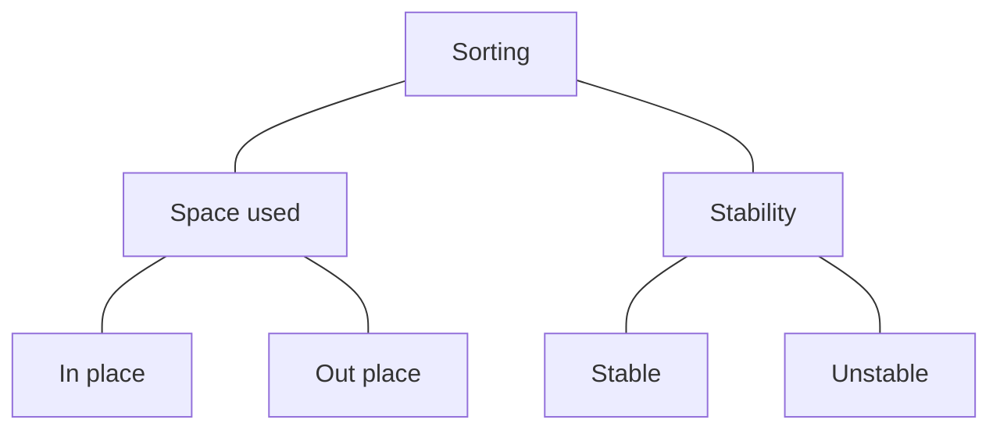

### What is Sorting?
By definition sorting refers to arranging data in a particular format: either ascending or descending.

### Types of Sorting:

### Classification By Space (Memory) usage:
- **In place sorting:** Sorting algorithms which does not require any extra space for sorting
    - **Example:** Bubble Sort
- **Out place sorting:** Sorting algorithms which requires an extra space for sorting
    - **Example:** Merge Sort

### Classification By Stability:
- **Stable sorting:** If a sorting algorithm after sorting the contents does not change the sequence of similar content in which they appear, then this sorting is called stable sorting.
    - **Example:** Insertion Sort
- **Unstable sorting:** If a sorting algorithm after sorting the content change the sequence of similar content in which they appear, then it is called unstable sorting.
    - **Example:** Quick Sort

### Sorting Terminology:
- **Increasing Order**
    - If successive element is greater than the previous one
    - Example: 1, 3, 5, 7, 9, 11
- **Decreasing Order**
    - If successive element is less than the previous one
    - Example: 11, 9, 7, 5, 3, 1
- **Non Increasing Order**
    - If successive element is less than or equal to its previous element in the sequence
    - Example: 11, 9, 7, 5, 5, 3, 1
- **Non Decreasing Order**
    - If successive element is greater than or equal to its previous element in the sequence
    - Example: 1, 3, 5, 5, 7, 9, 11

### Some Important Sorting Algorithms:
- Bubble Sort
- Selection Sort
- Insertion Sort
- Bucket Sort
- Merge Sort
- Quick Sort
- Heap Sort
