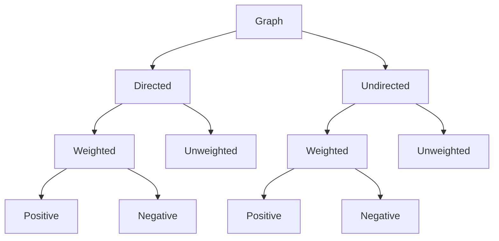

### Important topics to learn:
- What is a graph? Why do we need it?
- Graph Terminologies.
- Types of graphs. Graph Representation.
- Traversal of graphs (BFS and DFS).
- Topological Sorting.
- Single source shortest path (BFS, Dijkstra and Bellman Ford algorithms).
- All pairs shortest path (BFS, Dijkstra, Bellman Ford and Floyd Warshall algorithms).
- Minimum Spanning Tree (Kruskal and Prim algorithms).

### Graph Terminology
- **Vertices:** Vertices are the nodes of the graph
- **Edge:** The edge is the line that connects pairs of vertices
- **Unweighted graph:** A graph which does not have a weight associated with any edge
- **Weighted graph:** A graph which has a weight associated with any edge
- **Undirected graph:** In case the edges of the graph do not have a direction associated with them
- **Directed graph:** If the edges in a graph have a direction associated with them
- **Cyclic graph:** A graph which has at least one loop
- **Acyclic graph:** A graph with no loop
- **Tree:** It is a special case of directed acyclic graphs

### Graph Types

### Graph Representation
- **Adjacency Matrix:** an adjacency matrix is a square matrix or you can say it is a 2D array. And the elements of the matrix indicate whether pairs of vertices are adjacent or not in the graph.
- **Adjacency List:** an adjacency list is a collection of unordered list used to represent a graph. Each list describes the set of neighbors of a vertex in the graph.